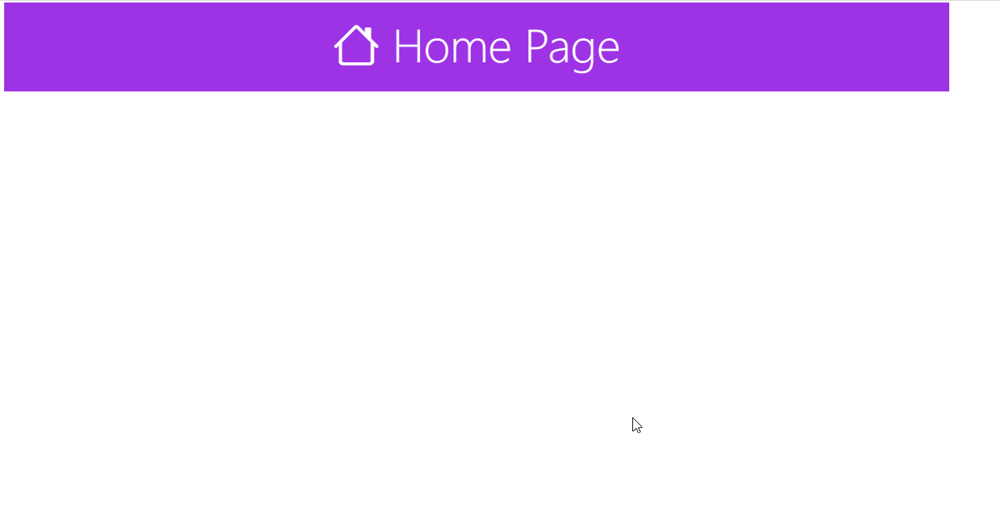

# dj-bootstrap #
Django Project Starter Template with Bootstrap Integration
## Try Project:
1. ***Clone this Repo***
    1. A nested numbered list
    2. Which is numbered
2. ***Setup and Install***
    1. Run **"pipenv install"** from project directory
    2. Activate Virtual Environment using **"pipenv shell"**
    3. Now Run the Project using **"py manage.py runserver"**
  
 # Preview:
 
